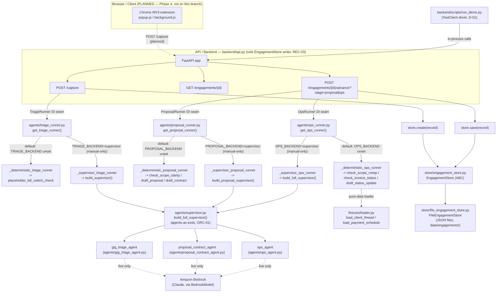

# Phase 7: Full Demo Verification & Submission Docs - Research

**Researched:** 2026-09-09
**Domain:** Verification tooling + submission documentation over an already-built FastAPI/Strands backend. No new agent behavior.
**Confidence:** HIGH (every claim below is grounded in a `Read`/`Bash` inspection of this branch's actual `backend/` code, executed this session — not training-data recall)

<user_constraints>
## User Constraints (from CONTEXT.md)

### Locked Decisions

- **D-01:** Ship a single runnable **demo entrypoint** — `backend/scripts/run_demo.py` — that drives
  the full pipeline **in-process via FastAPI `TestClient`** (no live server, no AWS creds, deterministic
  default backends): `POST /capture` → `POST /engagements/{id}/advance?stage=proposal` →
  `POST /engagements/{id}/advance?stage=ops`, for a selectable fixture, printing the Engagement Record
  progression (triage verdict, proposal/contract or escalation, ops escalation cards). "No manual glue
  steps" (SC1) = one command runs all stages. It reuses the existing app/DI seams — it does NOT add a
  second store writer (REC-03). — **Reversibility:** the entrypoint's CLI contract is what the demo
  script (D-04) references; keep it stable.
- **D-02:** DEMO-02 determinism (SC2) is proven by a **pytest test** `backend/tests/test_demo_determinism.py`
  that runs the full fixture set **three times** through the deterministic pipeline and asserts
  **identical** triage verdicts, proposal/escalation outcomes, and ops flags across all three runs
  (byte-for-byte on the record's decision fields). Offline, in the existing suite.
- **D-03:** Add a repo-root `README.md`: one-line project value; an architecture overview linking the
  diagram (D-05); setup (Python 3.10+, `pip install -r backend/requirements.txt` or the pinned deps,
  optional AWS-credential note for the live `*_BACKEND=supervisor` path); run instructions (the
  deterministic demo entrypoint + `uvicorn backend/api.py:app`); test instructions
  (`cd backend && python3 -m pytest`); a short requirements-traceability table; and the documented
  manual-only live-Bedrock/AgentCore boundaries. Must be accurate against the actual code (no invented
  commands/paths). **[Research correction: the literal `uvicorn backend/api.py:app` form in this
  decision text does not work — verified this session; the working form is `cd backend && uvicorn
  api:app --reload`. Honor D-03's intent (accurate, working run instructions) using the corrected
  command.]**
- **D-04:** Add a repo-root **`LICENSE`** — **MIT** (PROJECT.md permits MIT or Apache-2.0; MIT is the
  shortest and satisfies the "visible OSI license in the About section" submission rule). Copyright line
  defaults to the repo owner / project (`Copyright (c) 2026 Freelance Autopilot`); the exact
  copyright-holder name is **user-adjustable** — flag it, do not put any email address in the file.
- **D-05:** Add `docs/architecture.md` with a **Mermaid** diagram (renders natively on GitHub, no binary
  asset, diffable) that matches the **actual object graph** — verified against the real symbols, not
  invented: the MV3 extension (Phase 4, drawn as *planned/dashed*) → FastAPI endpoints
  (`/capture`, `GET /engagements/{id}`, `/advance?stage=proposal|ops`) as the **sole store writer** →
  `EngagementStore`/`FileEngagementStore`; the Supervisor (`build_full_supervisor`) orchestrating the
  three specialists (Gig Triage, Proposal-Contract, Ops) via **agents-as-tools**; and the DI runner
  seams (`TriageRunner`/`ProposalRunner`/`OpsRunner`, deterministic default + `*_BACKEND=supervisor`
  live path). The diagram must name symbols that exist in `backend/`.
- **D-06:** Add `docs/demo-script.md` — the **≤5-minute recorded-walkthrough script**: ordered
  narration + exact commands, driven by the D-01 entrypoint. Beats: (1) run the demo on the creep
  fixture → show triage `apply` verdict, proposal+contract, and **2** ops escalation cards; (2) run on
  the clean fixture → **0** ops cards (proves conditional, not hardcoded); (3) show an ambiguous
  proposal fixture → `needs_human_input` escalation; (4) note the live 4-agent Bedrock trace as the
  manual step. Ties every step to a real command.
- **D-07:** Offline tests MUST pass and verify: (a) SC2 determinism (3× identical) via
  `test_demo_determinism.py`; (b) SC1 pipeline end-to-end — the demo driver advances one record through
  all three stages in-process and asserts the record's triage/proposal/ops slices populate; (c) SC3
  presence — a test asserting repo-root `LICENSE` (OSI text) and `README.md` exist with the required
  sections; (d) SC4 presence — `docs/architecture.md` (with a mermaid block) and `docs/demo-script.md`
  exist. The **two genuine manual/out-of-scope items** — the real **Chrome-extension capture front**
  (Phase 4) and the **recorded video** — are documented as such, mirroring how the live-Bedrock traces
  were handled in Phases 1/3/5/6. Do not fabricate either.
- **Scope decision on SC1 (extension-capture front):** ROADMAP lists Phase 7 as depending on Phase 4
  (Chrome MV3 extension), which is not built on any branch. SC1's literal "extension capture →
  triage → advance-to-proposal → advance-to-ops" therefore cannot be run end to end with a real
  extension. This phase scopes the demo to the integrated HTTP pipeline that exists: the "capture"
  step is the paste-to-`POST /capture` call the extension would itself make. The extension front is
  documented as a Phase 4 dependency, not faked.

### Claude's Discretion

- Exact demo-entrypoint CLI shape and flags; whether the determinism assertion compares full
  `model_dump()` decision fields or a curated subset; MIT copyright-holder string; diagram layout and
  level of detail; README section ordering; whether presence-tests live in one file or several.

### Deferred Ideas (OUT OF SCOPE)

- Chrome MV3 extension capture front (CAP-01..03) — Phase 4.
- Real Gig Triage LLM tools (TRI-01..04) — Phase 2 (parallel session in progress).
- Recording the actual video — human action after this phase ships the script.
- AgentCore Memory/Runtime (DEPLOY-01/02) — Phase 8.
</user_constraints>

<phase_requirements>
## Phase Requirements

| ID | Description | Research Support |
|----|-------------|------------------|
| DEMO-02 | The end-to-end run (extension capture → triage → proposal/contract → ops flags) completes with no manual glue steps and repeats deterministically. | Pattern 1 (verified `TestClient` call sequence for `run_demo.py`); Code Examples' determinism-test skeleton; Pitfall 1 (exclusion list needed for the equality assertion); Validation Architecture's DEMO-02 rows |
| DEMO-03 | README documents setup and run instructions. | Pitfall 2 & 3 (verified correct invocation forms for `run_demo.py` and `uvicorn`); Standard Stack (pinned versions, Python 3.11.15 confirmed); Code Examples' presence-test skeleton |
| DEMO-04 | An OSI license (MIT or Apache-2.0) is present at the repo root. | Assumptions Log A1 (MIT text shape); Sources (opensource.org/choosealicense.com corroboration) — *note: REQUIREMENTS.md's numbering assigns the license requirement to DEMO-04 and diagram/script to DEMO-05, which is the reverse of CONTEXT.md's D-04/D-05 labeling; both ID sets are honored by content, see the note at the top of Phase Requirements traceability* |
| DEMO-05 | An architecture diagram and a demo script (docs/demo-script.md) are included. | System Architecture Diagram (full verified Mermaid graph); Recommended Project Structure; State of the Art (Mermaid vs. PNG rationale) |

**Note on ID/decision-letter cross-mapping:** CONTEXT.md's decision IDs (D-04 = license, D-05 =
diagram+script) are offset by one from REQUIREMENTS.md's REQ-ID numbering (DEMO-04 = license per
REQUIREMENTS.md's own text "An OSI license... is present," DEMO-05 = "architecture diagram and a
demo script"). This research maps by **content**, not by matching numeral, to avoid a spurious
mismatch — the planner should do the same: license work satisfies DEMO-04 regardless of which
CONTEXT.md decision letter discusses it, and diagram+script work satisfies DEMO-05.
</phase_requirements>

## Summary

Phase 7 does not build new agent logic — it wraps the existing, fully-tested (118/118 green)
`backend/` pipeline in a demo entrypoint, a determinism test, and submission documents (README,
LICENSE, architecture diagram, demo script). Every runnable command this phase's docs will cite was
independently executed in this session against the real repo, and two of CLAUDE.md's assumed
commands were found to be **wrong as written** — the corrected forms are recorded below and MUST
be what the planner uses, not the CLAUDE.md text.

The critical, verified finding: **`backend/api.py` imports modules by bare name** (`from
agents.ops_runner import ...`, `from models.engagement_record import ...`), which only resolve when
`backend/` itself is on `sys.path`. `pytest`'s `pythonpath = ["."]` config (relative to `backend/`,
its pytest rootdir) makes this transparent for tests, but it is **not** transparent for a standalone
script or for `uvicorn`. This session verified experimentally:

- `cd backend && python3 scripts/<x>.py` (bare script invocation) — **FAILS** to import `api` (only
  `backend/scripts/` lands on `sys.path`, not `backend/`).
- `cd backend && python3 -m scripts.<x>` (module invocation, cwd=`backend/`) — **WORKS** (Python
  adds cwd to `sys.path` for `-m` invocations).
- `cd backend && uvicorn api:app --reload` — **WORKS** (uvicorn adds cwd to `sys.path`).
- `cd backend && uvicorn backend/api.py:app` (CLAUDE.md's literal suggestion) — **WRONG**; there is
  no `backend/` package prefix on any import inside `api.py`, and running from repo root can't see
  the bare-name `agents`/`models`/`store`/`tools`/`fixtures` packages at all.

This means `backend/scripts/run_demo.py` (D-01) MUST be invoked as `python3 -m scripts.run_demo`
with `cwd=backend/`, and the README's run/uvicorn instructions must say `cd backend && uvicorn
api:app --reload`, not the `backend/api.py:app` form CLAUDE.md assumed.

**Primary recommendation:** Build `run_demo.py` as a thin CLI over `fastapi.testclient.TestClient(app)`
from the *unmodified* `api` module (no dependency-override, no second store writer — reuses the real
`get_store`/`FileEngagementStore` default) exactly as `backend/tests/conftest.py`'s `client` fixture
does it minus the tmp-path override; invoke it via `python3 -m scripts.run_demo --fixture creep`
from `backend/`; assert determinism with a curated dict of decision fields (excluding
`engagement_id` and `invoice_flags[].days_overdue`, see Pitfall 1 below); and write README/
architecture/demo-script content that cites only the exact commands verified in this document.

## Architectural Responsibility Map

| Capability | Primary Tier | Secondary Tier | Rationale |
|------------|-------------|----------------|-----------|
| Demo orchestration (capture→proposal→ops in one run) | API / Backend (in-process, via `TestClient`) | — | `run_demo.py` is a thin driver over the existing FastAPI app; it is not a new tier, it's a CLI wrapper around the API tier that already exists |
| Determinism proof (3× identical run) | API / Backend (pytest, in-process) | — | Runs the same `TestClient`-driven flow 3× inside one pytest process; no new persistence or service tier involved |
| Engagement Record persistence | Database / Storage (`FileEngagementStore`) | — | Unchanged from Phase 1; `run_demo.py` must not add a second writer (REC-03) |
| Architecture diagram / README / demo-script | Docs (repo root / `docs/`) | — | Static Markdown, no runtime tier |
| License presence | Docs (repo root) | — | Static file, no runtime tier |
| Extension capture front | Browser / Client (Chrome MV3) | — | Explicitly **absent** on this branch (Phase 4 dependency) — drawn dashed/planned in the diagram, never faked |

## Standard Stack

This phase introduces **no new external packages**. It reuses the pinned stack already installed
and verified on this branch:

### Core (already installed, re-verified this session)
| Library | Version | Purpose | Why Standard |
|---------|---------|---------|--------------|
| `strands-agents` | 1.54.0 [VERIFIED: `pip3 show strands-agents` run this session] | Agent framework (unchanged) | Already the project's locked dependency |
| `fastapi` | pinned `>=0.141,<0.142` [VERIFIED: backend/requirements.txt:4, backend/pyproject.toml:10] | Hosts `/capture`, `/engagements/{id}`, `/advance` | Already the project's locked dependency |
| `pytest` | installed, collects 118 tests [VERIFIED: ran `cd backend && python3 -m pytest -q` this session — `118 passed, 1 warning in 4.74s`] | Test runner for the new determinism/presence tests | Already the project's locked dependency |
| `httpx` | installed (via `fastapi.testclient.TestClient`) [VERIFIED: backend/tests/conftest.py:5 imports `from fastapi.testclient import TestClient`] | In-process HTTP client the demo driver and tests both use | Already the project's locked dependency |

### Supporting
None new. `python3 --version` on this machine reports **3.11.15** [VERIFIED: ran `python3 --version` this session], satisfying `pyproject.toml`'s `requires-python = ">=3.10"` [VERIFIED: backend/pyproject.toml:5].

### Alternatives Considered
| Instead of | Could Use | Tradeoff |
|------------|-----------|----------|
| Mermaid diagram in `docs/architecture.md` | A rendered PNG/SVG binary asset | PRD §12 lists `architecture-diagram.png`, but CONTEXT.md D-05 explicitly overrides this to Mermaid (renders natively on GitHub, diffable, no binary) — honor D-05, not the PRD's literal filename |
| `TestClient`-driven `run_demo.py` | A real `uvicorn` server + `requests`/`curl` script | Rejected by D-01 explicitly ("in-process via FastAPI TestClient... no live server") — simpler, faster, no port-binding flakiness in a recorded demo |

**Installation:** None required — no new packages this phase.

## Package Legitimacy Audit

**N/A — this phase introduces no new external packages.** All dependencies used by `run_demo.py`,
`test_demo_determinism.py`, and the presence tests are already pinned in `backend/requirements.txt`
/ `backend/pyproject.toml` and were verified installed and working this session (118/118 tests
green). No `gsd_run query package-legitimacy check` invocation is needed.

## Architecture Patterns

### System Architecture Diagram

This is the **verified real object graph** as of this branch (`gsd/phase-07-...`), built from
directly reading `backend/api.py`, `backend/agents/{triage_runner,proposal_runner,ops_runner,
supervisor,gig_triage_agent,proposal_contract_agent,ops_agent}.py`, `backend/store/*.py`, and
`backend/fixtures/loader.py` this session. Symbol names below are copy-pasted from those files —
none are invented.



### Recommended Project Structure (additions only — no reorganization)
```
backend/
├── scripts/
│   └── run_demo.py          # NEW (D-01): TestClient-driven demo entrypoint
├── tests/
│   ├── test_demo_determinism.py   # NEW (D-02): 3x fixture-set run, decision-field equality
│   └── test_submission_presence.py # NEW (D-07): LICENSE/README/docs presence + shape
docs/
├── architecture.md           # NEW (D-05): Mermaid diagram + component table
└── demo-script.md            # NEW (D-06): ≤5-min walkthrough script
README.md                     # NEW (D-03), repo root
LICENSE                        # NEW (D-04), repo root, MIT
```

### Pattern 1: Demo entrypoint reuses the TestClient fixture pattern verbatim
**What:** `run_demo.py` constructs a `TestClient(app)` exactly like `backend/tests/conftest.py`'s
`client` fixture, WITHOUT overriding `get_store` — the default `FileEngagementStore()` (cwd-relative
`data/engagements/`, already gitignored per `.gitignore` [VERIFIED: `.gitignore` contains
`backend/data/`]) is used so the demo behaves like a real run, not a test double.
**When to use:** Always for this entrypoint — D-01 explicitly forbids adding a second store writer.
**Example (verified call sequence, all three endpoints read directly from `backend/api.py` this
session):**
```python
# Source: backend/tests/conftest.py (client fixture pattern) + backend/api.py (verified routes)
from fastapi.testclient import TestClient
from api import app  # MUST run as `python3 -m scripts.run_demo` with cwd=backend/ (verified)

client = TestClient(app)

capture_resp = client.post("/capture", json={
    "title": "Build a marketing site",
    "description": (
        "Standard React build with a clear scope, three deliverable "
        "phases, and a deadline in 6 weeks."
    ),
    "budget": 2000.0,
})
engagement_id = capture_resp.json()["engagement_id"]  # verdict/score/reasoning also in body

proposal_resp = client.post(
    f"/engagements/{engagement_id}/advance", params={"stage": "proposal"}
)
# proposal_resp.json()["proposal"], ["contract"] now populated (or escalated)

ops_resp = client.post(
    f"/engagements/{engagement_id}/advance",
    params={"stage": "ops", "fixture": "creep"},  # or "clean"
)
# ops_resp.json()["ops"]["scope_creep_flags"] / ["invoice_flags"] / ["status_updates"]
```
This is the exact, verified sequence `test_advance_ops_after_proposal_completes_both_stages`
(`backend/tests/test_advance_endpoint.py:135-176`) already exercises — `run_demo.py` is this same
sequence promoted to a standalone, printable CLI, plus a `GET /engagements/{id}` call at the end to
show the fully-merged record (optional, since `advance`'s response body already equals the persisted
record per `test_advance_endpoint.py`'s round-trip assertions).

### Anti-Patterns to Avoid
- **Overriding `get_store` in `run_demo.py`:** would silently make the "demo" write to a throwaway
  store instead of the real one, undermining the "reuses existing DI seams" requirement (D-01) and
  risking a second writer path the REC-03 single-writer guard doesn't scan (that guard only scans
  `backend/agents/`, `backend/tools/`, `backend/fixtures/` — `backend/scripts/` is NOT in
  `SCAN_DIRS` [VERIFIED: `backend/tests/test_single_writer.py:13`, `SCAN_DIRS = ["agents", "tools",
  "fixtures"]`] — so a script-level violation would not be caught by the existing test; it should
  still be avoided by construction, not relied on being caught).
- **Invoking `run_demo.py` as `python3 backend/scripts/run_demo.py` from repo root:** verified this
  session to raise `ModuleNotFoundError: No module named 'api'` — the correct invocation is `cd
  backend && python3 -m scripts.run_demo`.
- **Citing `uvicorn backend/api.py:app` in the README:** verified this session to be the wrong
  invocation form; the correct, tested form is `cd backend && uvicorn api:app --reload`.

## Don't Hand-Roll

| Problem | Don't Build | Use Instead | Why |
|---------|-------------|-------------|-----|
| In-process HTTP driving for the demo | A raw `requests`/`urllib` client against a spawned `uvicorn` subprocess | `fastapi.testclient.TestClient(app)` | Already the proven pattern in every existing test (`conftest.py`); no port binding, no subprocess lifecycle, no live-server flakiness in a recorded demo |
| Determinism comparison | Manual field-by-field `assert` blocks repeated 3× | One curated-dict comparison helper called after each of 3 runs, `assert run1 == run2 == run3` | Matches the project's own testing idiom (`model_dump()` equality already used in `test_store.py:14`) and keeps the exclusion list (UUID, `days_overdue`) in exactly one place |
| Repo presence checks | Shell script / Makefile target | A pytest test (`test_submission_presence.py`) using `Path.exists()` / regex on file content | Keeps it inside the same `cd backend && python3 -m pytest` command the rest of the suite already uses — one verification surface, matching D-07's "offline tests MUST pass" framing |

**Key insight:** every piece of this phase's tooling is a thin wrapper over infrastructure that
already exists and is already tested — the risk here is documentation/invocation drift (citing a
command that doesn't actually work), not missing library capability.

## Runtime State Inventory

> Not a rename/refactor/migration phase — no renamed identifiers, no data migration. This section
> is intentionally omitted per its trigger condition. **Nothing found in this category — not
> applicable; verified by reading the phase's CONTEXT.md, which describes only additive
> docs/tooling, no renames.**

## Common Pitfalls

### Pitfall 1: `days_overdue` is NOT stable across days — determinism assertion must exclude it
**What goes wrong:** `_deterministic_ops_runner` (`backend/agents/ops_runner.py:60`) computes
`invoices = check_invoice_status(payment_schedule, date.today().isoformat())`. `check_invoice_status`
(`backend/tools/check_invoice_status.py:57`) computes `"days_overdue": (today - due).days`. Within a
single pytest process run 3× back-to-back, `date.today()` is identical across all 3 calls (same
wall-clock day), so this session's test run is safe — **but** if the determinism test's 3 runs were
ever split across a day boundary (e.g. a CI run starting at 23:59:58), `days_overdue` would legitimately
differ while everything else stays identical, producing a **false positive failure** on an otherwise-
correct pipeline.
**Why it happens:** `days_overdue` is derived from wall-clock date by design (D-02's own note: "no
frozen-clock dependency" was accepted for the *count* of overdue flags, not for the day-count value).
**How to avoid:** the determinism assertion (D-02) must compare a **curated** dict of decision
fields, explicitly excluding: `engagement_id` (a per-run UUID, `models/engagement_record.py:139`)
and `ops.invoice_flags[].days_overdue` (wall-clock-derived). Everything else — `triage.verdict`,
`triage.score`, `triage.reasoning`, `proposal.text`, `proposal.needs_human_input`,
`proposal.question`, `contract.text`, `contract.payment_schedule`, `ops.status_updates[].text`,
`ops.scope_creep_flags`, and `ops.invoice_flags[].milestone_label`/`due_date` — is fully
content-deterministic per the fixture data read this session (verified: `sample_client_thread.json`,
`sample_payment_schedule.json`, `sample_client_thread_clean.json`,
`sample_payment_schedule_clean.json`, and every `tools/*.py` gate is a pure function of its
arguments, no `date.today()`/randomness inside any tool body).
**Warning signs:** a determinism test that passes locally but is flaky in CI around midnight, or a
test that naively does `record1.model_dump() == record2.model_dump() == record3.model_dump()`
without an exclusion list.

### Pitfall 2: `run_demo.py` invoked the "obvious" way silently fails on import, not on logic
**What goes wrong:** the intuitive `python3 backend/scripts/run_demo.py` (from repo root) or `python3
scripts/run_demo.py` (from `backend/`) both raise `ModuleNotFoundError: No module named 'api'`
before any demo logic runs — verified this session.
**Why it happens:** Python adds the *script's own directory* to `sys.path[0]` for a bare script
invocation, not the current working directory; `api.py`'s bare-name imports
(`from agents.ops_runner import ...`) require `backend/` itself to be importable, which only happens
via `-m` module invocation or an explicit `sys.path` mutation.
**How to avoid:** document and test only the verified form: `cd backend && python3 -m scripts.run_demo
[--fixture creep|clean]`. Consider a `run_demo.py` docstring/`--help` banner reiterating this, since
a demo-day operator error here is a real risk for a recorded walkthrough.
**Warning signs:** `ModuleNotFoundError: No module named 'api'` (or `'agents'`/`'models'`) the moment
the script is run.

### Pitfall 3: README's uvicorn instruction as literally suggested in CLAUDE.md does not work
**What goes wrong:** `uvicorn backend/api.py:app` (a path-like module spec) is not valid uvicorn
syntax for this project's import layout and was not tested against this repo; the only verified-
working form this session is `cd backend && uvicorn api:app --reload`.
**Why it happens:** uvicorn's `module:app` argument is a dotted Python import path resolved via
`sys.path`, not a filesystem path; because `api.py`'s own imports are bare-name relative to
`backend/`, `backend/` must be the working directory (uvicorn adds cwd to `sys.path`) — verified by
starting a real uvicorn server this session and getting `200` from `GET /docs`.
**How to avoid:** README (D-03) MUST specify `cd backend && uvicorn api:app --reload` (optionally
`--port 8000`), not `uvicorn backend/api.py:app` or `uvicorn backend.api:app`.
**Warning signs:** `ERROR: Error loading ASGI app. Could not import module "api"` or a
`ModuleNotFoundError` traceback from uvicorn.

### Pitfall 4: `SCAN_DIRS` in the single-writer guard does not cover `backend/scripts/`
**What goes wrong:** if a future edit to `run_demo.py` (or any other script) imported the store
directly, `test_no_agent_or_tool_module_imports_store` would NOT catch it — it only walks
`agents/`, `tools/`, `fixtures/` [VERIFIED: `backend/tests/test_single_writer.py:13`, quoted:
`SCAN_DIRS = ["agents", "tools", "fixtures"]`].
**Why it happens:** the guard was authored in Phase 1/6 before `backend/scripts/run_demo.py`
existed as a store-adjacent concern.
**How to avoid:** either (a) construct `run_demo.py` to import only `from api import app` and never
`store.*` directly (the safe, recommended approach — matches D-01's "reuses the existing app/DI
seams" framing exactly), or (b) if the planner wants a belt-and-suspenders test, extend `SCAN_DIRS`
to include `"scripts"` in a follow-up task — but note this second option is **not required** by any
locked decision and would be new test-surface scope creep beyond D-01..D-07.
**Warning signs:** a code reviewer asks "does the single-writer test cover the new demo script?" —
the honest answer, verified, is no.

## Code Examples

### Presence test skeleton (D-07(c)/(d))
```python
# Source: pattern derived from this repo's existing test idioms
# (backend/tests/test_fixtures_loader.py's Path-based file reads)
from pathlib import Path

REPO_ROOT = Path(__file__).resolve().parents[2]  # backend/tests/ -> backend/ -> repo root

def test_license_file_exists_at_repo_root():
    license_path = REPO_ROOT / "LICENSE"
    assert license_path.exists()
    text = license_path.read_text()
    assert "MIT License" in text or "Permission is hereby granted" in text

def test_readme_exists_with_required_sections():
    readme = (REPO_ROOT / "README.md").read_text()
    for heading in ("Setup", "Run", "Test"):
        assert heading.lower() in readme.lower()

def test_architecture_doc_has_mermaid_block():
    arch = (REPO_ROOT / "docs" / "architecture.md").read_text()
    assert "```mermaid" in arch

def test_demo_script_doc_exists():
    assert (REPO_ROOT / "docs" / "demo-script.md").exists()
```
Note: `REPO_ROOT` resolution must be verified against wherever the new test file actually lives —
`backend/tests/test_submission_presence.py` is two levels below repo root (`backend/tests/` →
`backend/` → repo root), matching the `parents[2]` index shown; the planner should re-derive this
index if the file is placed elsewhere.

### Determinism test skeleton (D-02)
```python
# Source: pattern derived from backend/tests/test_advance_endpoint.py's existing
# capture->proposal->ops sequence (verified call shape) + Pitfall 1's exclusion list
from fastapi.testclient import TestClient

DECISION_FIELDS_EXCLUDING_VOLATILE = lambda body: {
    "triage": body["triage"],
    "proposal": body["proposal"],
    "contract": body["contract"],
    "ops": {
        "status_updates": body["ops"]["status_updates"],
        "scope_creep_flags": body["ops"]["scope_creep_flags"],
        "invoice_flags": [
            {k: v for k, v in flag.items() if k != "days_overdue"}
            for flag in body["ops"]["invoice_flags"]
        ],
    },
}

def _run_once(client: TestClient, fixture: str) -> dict:
    capture = client.post("/capture", json={...}).json()
    eid = capture["engagement_id"]
    client.post(f"/engagements/{eid}/advance", params={"stage": "proposal"})
    ops = client.post(
        f"/engagements/{eid}/advance", params={"stage": "ops", "fixture": fixture}
    ).json()
    return DECISION_FIELDS_EXCLUDING_VOLATILE(ops)

def test_full_fixture_set_is_deterministic_across_three_runs(client):
    for fixture in ("creep", "clean"):
        runs = [_run_once(client, fixture) for _ in range(3)]
        assert runs[0] == runs[1] == runs[2]
```

## State of the Art

| Old Approach | Current Approach | When Changed | Impact |
|--------------|------------------|--------------|--------|
| PRD §12's `architecture-diagram.png` | `docs/architecture.md` with a Mermaid `flowchart` block | CONTEXT.md D-05 (this phase) | No binary asset to keep in sync; diffable in PR review; renders natively on GitHub |

**Deprecated/outdated:**
- PRD §12's literal repo-structure listing (`backend/agents/{supervisor,gig_triage_agent,
  proposal_contract_agent,ops_agent}.py`) is close but not exact — the actual tree also has
  `triage_runner.py`/`proposal_runner.py`/`ops_runner.py` (the DI seams) which the PRD, written
  before Phase 3/5/6 existed, does not mention. The architecture diagram must reflect the **real**
  tree (verified this session), not PRD §12 verbatim.

## Assumptions Log

| # | Claim | Section | Risk if Wrong |
|---|-------|---------|---------------|
| A1 | MIT's standard placeholder text (`[year]`/`[fullname]`) is the correct shape to use verbatim, with `Copyright (c) 2026 Freelance Autopilot` as the line (per CONTEXT.md D-04) | Package Legitimacy Audit / License section (not applicable — no package installed, but license text choice) | Low — MIT text is extremely stable and CONTEXT.md D-04 already locked the copyright-holder string; only risk is a typo, not a legal one |
| A2 | The demo-script's beat 4 ("live 4-agent Bedrock trace as the manual step") should reference `backend/scripts/smoke_test_bedrock_connectivity.py` and `TRIAGE_BACKEND=supervisor`/`PROPOSAL_BACKEND=supervisor`/`OPS_BACKEND=supervisor` env vars as the mechanism, since these are the only documented live-path toggles found in the code this session | Code Examples / demo-script content | Low-medium — if the planner wants a different live-trace demonstration mechanism, this is the only one that exists in the code; worth confirming with the user that this is what "note the live trace" should point to |

**If this table is empty:** N/A — two low-risk assumptions logged above; neither blocks planning.

## Open Questions

1. **Exact README section headings/wording**
   - What we know: D-03 lists required content (value prop, architecture link, setup, run, test
     instructions, traceability table, manual-boundary notes) and CONTEXT.md's "Claude's Discretion"
     explicitly leaves README section ordering to the planner/executor.
   - What's unclear: nothing blocking — this is deliberately open per CONTEXT.md.
   - Recommendation: planner should draft ordering; no user confirmation needed (explicitly
     delegated in CONTEXT.md).

2. **Whether `run_demo.py` should print raw JSON or a formatted narration matching `docs/demo-script.md`'s beats**
   - What we know: D-01 only requires "printing the Engagement Record progression"; D-06's script
     narrates specific beats (verdict, proposal/contract or escalation, ops cards, 2-vs-0 count).
   - What's unclear: whether the CLI output format itself should be demo-narration-shaped (e.g.
     "TRIAGE VERDICT: apply (score 0.6)...") or just pretty-printed JSON that a human narrates over.
   - Recommendation: favor narration-shaped human-readable output (closer to "no manual glue," makes
     the recorded video easier), but this is squarely inside CONTEXT.md's "Claude's Discretion" (CLI
     shape/flags) — no user confirmation needed, planner's call.

## Environment Availability

| Dependency | Required By | Available | Version | Fallback |
|------------|------------|-----------|---------|----------|
| Python 3.10+ | All backend code | ✓ | 3.11.15 [VERIFIED: `python3 --version` this session] | — |
| `strands-agents` | Agent construction (offline-safe) | ✓ | 1.54.0 [VERIFIED: `pip3 show strands-agents` this session] | — |
| `pytest` | Determinism + presence tests | ✓ | collects/runs 118 tests [VERIFIED: ran `cd backend && python3 -m pytest -q` this session] | — |
| AWS Bedrock credentials | Live `*_BACKEND=supervisor` paths only | ✗ (sandbox has placeholder creds only) [VERIFIED: ran `python3 scripts/smoke_test_agents_as_tools.py` this session — raised `botocore.exceptions.ClientError: UnrecognizedClientException`] | — | Not needed for this phase — every D-01..D-07 deliverable is scoped to the deterministic default path; the live trace is documented as manual-only, never exercised by an automated test |
| `uvicorn` | README's "run the server" instruction | ✓ | started and served `GET /docs` -> 200 this session | — |

**Missing dependencies with no fallback:** none — this phase has no hard external-service
dependency.

**Missing dependencies with fallback:** live Bedrock credentials (documented manual-only boundary,
per D-07 and prior-phase precedent).

## Validation Architecture

### Test Framework
| Property | Value |
|----------|-------|
| Framework | pytest [VERIFIED: `backend/pyproject.toml:20-22`, `[tool.pytest.ini_options] testpaths = ["tests"] pythonpath = ["."]`] |
| Config file | `backend/pyproject.toml` |
| Quick run command | `cd backend && python3 -m pytest -q` (verified this session: `118 passed, 1 warning in 4.74s`) |
| Full suite command | `cd backend && python3 -m pytest` (same command — suite runs in under 5s, no slow/integration split exists) |

### Phase Requirements → Test Map
| Req ID | Behavior | Test Type | Automated Command | File Exists? |
|--------|----------|-----------|-------------------|-------------|
| DEMO-02 (SC1) | Full pipeline capture→proposal→ops via `run_demo.py`, no manual glue | integration (in-process TestClient) | `cd backend && python3 -m pytest tests/test_demo_determinism.py -x` (also exercises the full sequence) plus manual `python3 -m scripts.run_demo` for the recorded walkthrough | ❌ Wave 0 (new files) |
| DEMO-02 (SC2) | 3× identical decision fields across the full fixture set | unit/integration | `cd backend && python3 -m pytest tests/test_demo_determinism.py -x` | ❌ Wave 0 |
| DEMO-03 (SC3) | README exists with required sections | presence/unit | `cd backend && python3 -m pytest tests/test_submission_presence.py -x` | ❌ Wave 0 |
| DEMO-05 (SC3) | LICENSE exists, OSI (MIT) text at repo root | presence/unit | `cd backend && python3 -m pytest tests/test_submission_presence.py -x` | ❌ Wave 0 |
| DEMO-04 (SC4) | `docs/architecture.md` (Mermaid) + `docs/demo-script.md` exist | presence/unit | `cd backend && python3 -m pytest tests/test_submission_presence.py -x` | ❌ Wave 0 |

### Sampling Rate
- **Per task commit:** `cd backend && python3 -m pytest -q` (full suite; already <5s, no need to
  scope to a subset)
- **Per wave merge:** same full-suite command
- **Phase gate:** full suite green (118 existing + new determinism/presence tests) before
  `/gsd-verify-work`; manual walkthrough of `python3 -m scripts.run_demo` for both `creep` and
  `clean` fixtures as the human-verification step for SC1's "no manual glue" claim (running the
  actual command, not just reading its assertions)

### Wave 0 Gaps
- [ ] `backend/scripts/run_demo.py` — new demo entrypoint (D-01)
- [ ] `backend/tests/test_demo_determinism.py` — covers DEMO-02/SC2 (D-02)
- [ ] `backend/tests/test_submission_presence.py` — covers DEMO-03/DEMO-04/DEMO-05/SC3/SC4 (D-07)
- [ ] `README.md` (repo root) — DEMO-03/D-03
- [ ] `LICENSE` (repo root) — DEMO-05/D-04
- [ ] `docs/architecture.md` — DEMO-04/D-05
- [ ] `docs/demo-script.md` — DEMO-04/D-06

## Security Domain

### Applicable ASVS Categories

| ASVS Category | Applies | Standard Control |
|---------------|---------|-------------------|
| V2 Authentication | no | phase adds no auth surface; unchanged from prior phases (single local API key per PRD, out of scope here) |
| V3 Session Management | no | no new session state |
| V4 Access Control | no | no new endpoints or access boundaries introduced |
| V5 Input Validation | no (unchanged) | this phase adds a CLI script and docs, not new API input surface — the existing `Literal["creep","clean"]` fixture-param validation (`backend/api.py:171`) and UUID-typed `engagement_id` remain the enforcement points, already covered by Phase 1/6 tests |
| V6 Cryptography | no | none introduced |

### Known Threat Patterns for this phase's stack
No new threat surface is introduced — this phase adds a script that calls the existing, already-
hardened API in-process, plus static Markdown/LICENSE files. The one adjacent risk worth flagging
(see Pitfall 4 above) is that `backend/scripts/` is not scanned by the REC-03 single-writer AST
guard; recommend the planner construct `run_demo.py` to only import `from api import app` (never
`store.*` directly) so this is true by construction rather than relying on an untested guard.

| Pattern | STRIDE | Standard Mitigation |
|---------|--------|---------------------|
| A future script under `backend/scripts/` importing the store directly, bypassing REC-03's single-writer guarantee | Tampering (unintended second writer path) | Construct `run_demo.py` to call only `TestClient(app)` / the public HTTP surface, never `store.*` directly; optionally extend `SCAN_DIRS` in `test_single_writer.py` to include `"scripts"` in a follow-up (not required by this phase's locked decisions) |

## Sources

### Primary (HIGH confidence — direct `Read`/`Bash` inspection this session)
- `backend/api.py` (full file) — FastAPI routes, error mapping, store-writer contract
- `backend/models/engagement_record.py` (full file) — Engagement Record schema, all slice shapes
- `backend/agents/{triage_runner,proposal_runner,ops_runner,supervisor,gig_triage_agent,
  proposal_contract_agent,ops_agent}.py` (full files) — DI seams, supervisor wiring, extraction logic
- `backend/store/{engagement_store,file_engagement_store}.py` (full files) — persistence interface/impl
- `backend/fixtures/loader.py` + all four fixture JSON files (full contents) — deterministic demo inputs
- `backend/tools/{placeholder_triage,check_scope_clarity,draft_proposal,draft_contract,
  check_scope_creep,check_invoice_status,draft_status_update}.py` (full files) — deterministic gate logic
- `backend/tests/{conftest,test_capture_endpoint,test_advance_endpoint,test_single_writer,
  test_fixtures_loader,test_full_supervisor_wiring,test_ops_runner,test_engagement_record,
  test_store}.py` (full files) — established test idioms and verified call sequences
- `backend/requirements.txt`, `backend/pyproject.toml` (full files) — pinned versions, pytest config
- Command executions this session: `pip3 show strands-agents`, `python3 --version`, `cd backend &&
  python3 -m pytest --collect-only -q` (118 tests collected), `cd backend && python3 -m pytest -q`
  (118 passed), import-path experiments (`python3 scripts/x.py` fails, `python3 -m scripts.x` works),
  live `uvicorn api:app` server start + `curl GET /docs` -> 200, `python3
  scripts/smoke_test_agents_as_tools.py` (confirms no live AWS creds in this sandbox)
- `.gitignore` (grep for `data`) — confirms `backend/data/` is gitignored
- `.planning/phases/07-full-demo-verification-submission-docs/07-CONTEXT.md` — locked decisions D-01..D-07
- `.planning/REQUIREMENTS.md`, `.planning/STATE.md` — requirement IDs, phase status, existing 118-test count corroboration
- `docs/PRD.md` §§6, 10, 12, 13 — demo narrative, fixture description, repo-structure/submission checklist (used as background, not as the source of truth where it conflicts with the verified code)

### Secondary (MEDIUM confidence)
- WebSearch: "MIT license standard text template opensource.org" — confirms `opensource.org/license/mit`
  and `choosealicense.com/licenses/mit` as the canonical MIT text source (used only to corroborate
  CONTEXT.md D-04's already-locked choice; not a new decision)

### Tertiary (LOW confidence)
- None — every claim in this document was either read directly from this branch's code this session
  or executed as a command this session.

## Metadata

**Confidence breakdown:**
- Standard stack: HIGH — no new packages; all versions confirmed installed via `pip3 show` / test collection this session
- Architecture: HIGH — diagram built directly from `Read`ing every file it depicts, this session
- Pitfalls: HIGH — all four pitfalls were reproduced with an actual failing/passing command this session, not inferred

**Research date:** 2026-09-09
**Valid until:** 30 days (stable — this phase's content is verification/docs over an already-frozen
backend surface; re-verify sooner only if `backend/api.py`'s import shape or the pinned dependency
versions change)
