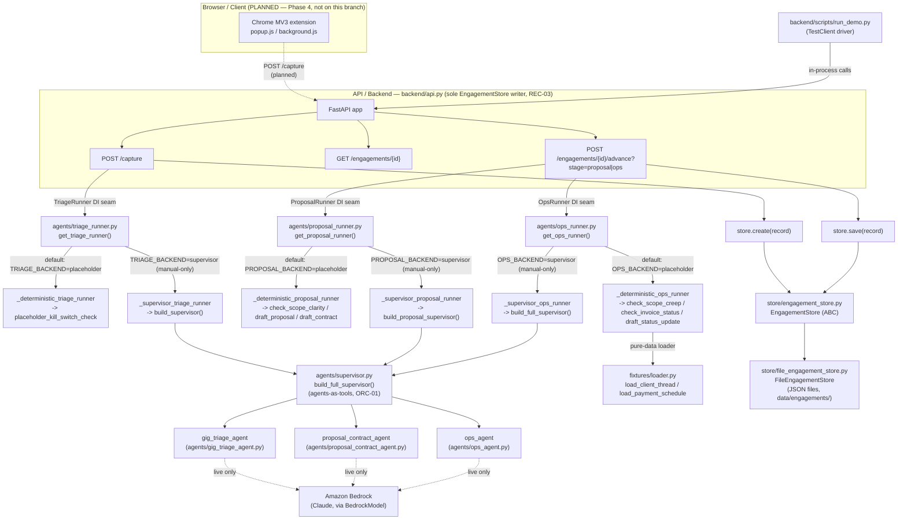

# Architecture

This diagram is grounded in the real `backend/` object graph — every symbol named below
exists in the code (verified by reading `backend/api.py`, `backend/agents/supervisor.py`,
`backend/agents/{triage_runner,proposal_runner,ops_runner}.py`, `backend/store/*.py`, and
`backend/fixtures/loader.py`). The Chrome MV3 extension is drawn dashed/planned because it
is a Phase 4 dependency that does not exist on this branch.

## Component Table

| Component | File | Role |
|-----------|------|------|
| FastAPI app | `backend/api.py` | Exposes `/capture`, `GET /engagements/{id}`, `/advance?stage=proposal\|ops`; the **sole** `EngagementStore` writer (REC-03) |
| Demo driver | `backend/scripts/run_demo.py` | `TestClient(app)`-driven CLI that runs the full pipeline in-process, no live server, no AWS creds required |
| TriageRunner / ProposalRunner / OpsRunner | `backend/agents/{triage_runner,proposal_runner,ops_runner}.py` | Dependency-injection seams FastAPI calls; each has a deterministic default path and a `*_BACKEND=supervisor` live path |
| Supervisor | `backend/agents/supervisor.py` (`build_full_supervisor`) | Unified Strands Supervisor orchestrating all three specialists as agents-as-tools (ORC-01) — used by the live path only |
| Specialist agents | `agents/gig_triage_agent.py`, `agents/proposal_contract_agent.py`, `agents/ops_agent.py` | The three specialists the Supervisor wraps; reach Amazon Bedrock only on the live path |
| Fixture loader | `backend/fixtures/loader.py` | Pure-data loader (`load_client_thread`, `load_payment_schedule`) feeding the deterministic ops path |
| Persistence | `backend/store/engagement_store.py` (`EngagementStore` ABC), `backend/store/file_engagement_store.py` (`FileEngagementStore`) | The single persistence interface + its one concrete JSON-file implementation, written to only by `api.py` |
| Chrome MV3 extension | *(not on this branch — Phase 4)* | Planned real-world capture front that would POST to `/capture`; drawn dashed above |
